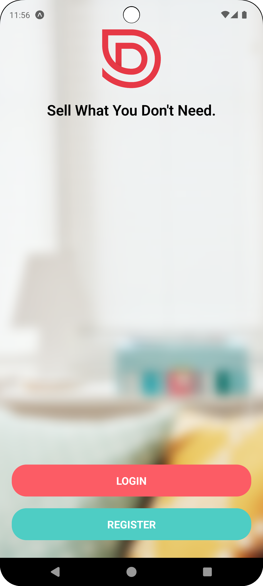
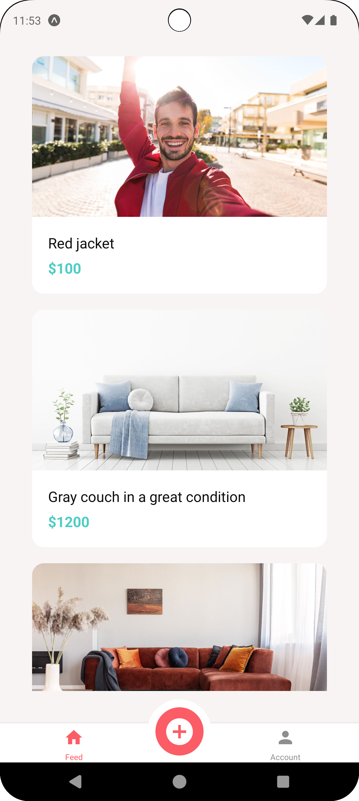
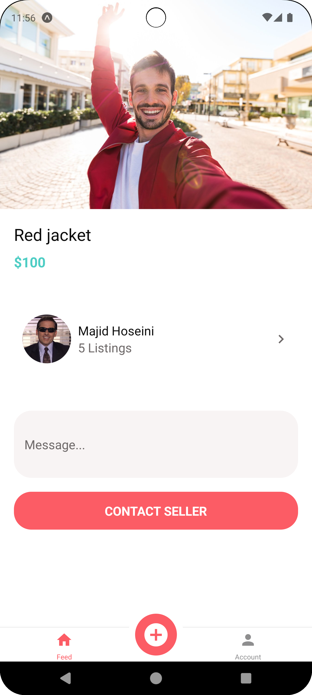
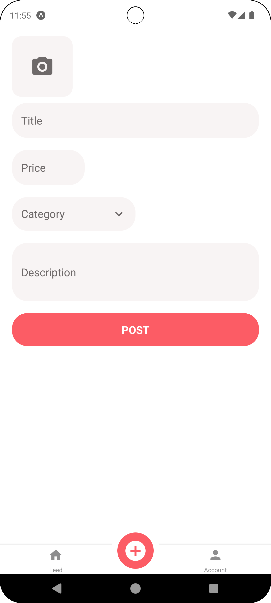
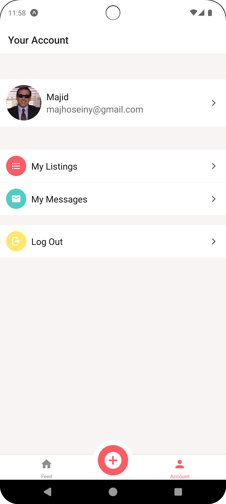
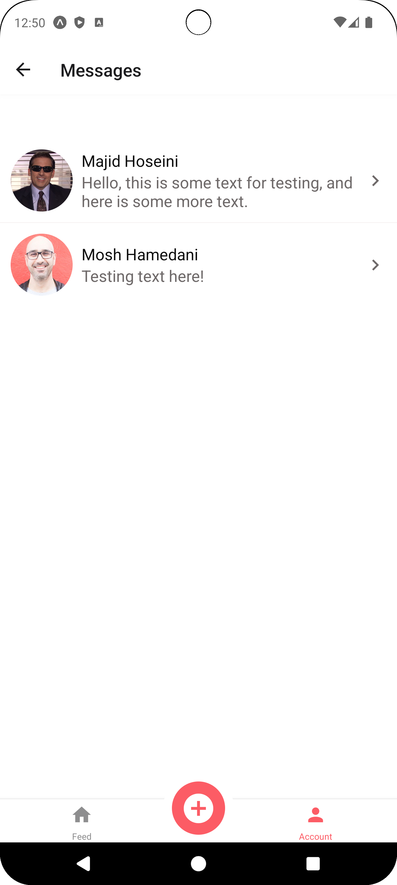

---

# DoneWithIt

This is the **DoneWithIt** app, a project built during Mosh Hamedani's React Native course, ["The Ultimate React Native Course (Part 1)"](https://codewithmosh.com/p/the-ultimate-react-native-course-part1). The app is a marketplace where users can list items they no longer need and browse items listed by others.

## Table of Contents

- [Features](#features)
- [Prerequisites](#prerequisites)
- [Installation](#installation)
- [Running the App](#running-the-app)
- [Backend Server](#backend-server)
- [Screenshots & Demo](#screenshots--demo)
- [Technologies Used](#technologies-used)
- [Contributing](#contributing)

## Features

- List items with images and descriptions.
- Browse items listed by other users.
- Send messages to item owners.
- User authentication.
- Error reporting with Bugsnag.

## Prerequisites

Before you can run this app, ensure you have the following installed:

- [Node.js](https://nodejs.org/)
- [Expo CLI](https://docs.expo.dev/get-started/installation/)
- [Expo Go](https://expo.dev/client) app installed on your mobile device (iOS or Android) or on a virtual device (e.g., Android Emulator or iOS Simulator).

## Installation

1. **Clone the Repository**:
    ```bash
    git clone https://github.com/majshub/DoneWithIt.git
    cd DoneWithIt
    ```

2. **Install Dependencies**:
    ```bash
    npm install
    ```

3. **Setup the Backend Server**:

   The app requires a backend server to manage data and authentication. The backend is located in a separate repository. Follow the instructions in the [DoneWithIt API Node repository](https://github.com/majshub/DoneWithIt-api-node) to clone, set up, and run the server.

   Make sure the server is running before starting the app.

## Running the App

You can run the app in two ways:

### 1. **View on Expo**

The app is also published on Expo. You can access it directly by visiting the following link:

[DoneWithIt on Expo](https://expo.dev/accounts/majidhoseini/projects/DoneWithIt)

Open this link on your mobile device using the Expo Go app, and you can instantly explore the app without setting up a development environment.

### 2. **Run Locally**

If you prefer to run the app locally, follow these steps:

1. **Start the Development Server**:
    ```bash
    npm start
    ```

2. **Connect to the App**:

   Once the development server is running, you'll receive a QR code and a link. Open the link on your mobile device using the Expo Go app, or connect through a virtual device using the same link.

## Screenshots & Demo

Below are screenshots and a demo video showcasing the DoneWithIt app.

### Screenshots








### Demo Video

[Demo Video](./media/activity_indicator.mp4)

## Technologies Used

- **React Native** - Framework for building native apps using React.
- **Expo** - A framework and a platform for universal React applications.
- **Node.js** - JavaScript runtime for the backend.
- **Express.js** - Web framework for Node.js used in the backend server.
- **Bugsnag** - Error monitoring and reporting tool integrated for tracking and fixing crashes and errors.

## Contributing

Contributions are welcome! Please feel free to submit a Pull Request or open an Issue for any feature requests, bug fixes, or general suggestions.

---
